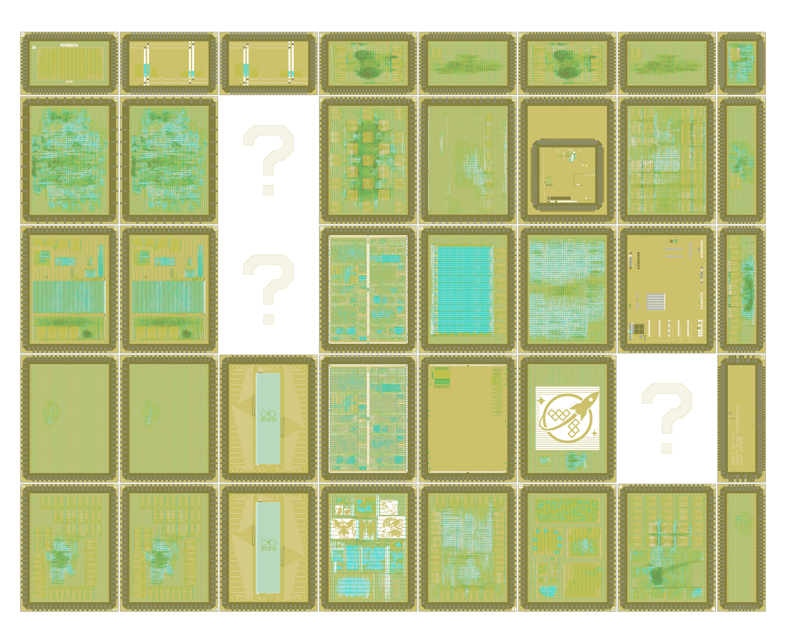

# wafer.space Run 1

[wafer.space](https://wafer.space/) GF180MCU Run 1

- Shuttle ID: G801
- Process: GF180MCU
- Number of slots: 40

<table width="100%">
  <tr>
  <td width="50%"></td>
  <td width="50%"></td>
  </tr>
</table>

The "?" indicate private projects that have been obfuscated to hide their layout.

# Public Projects

| Code | Project | Slot Size | Project Details | Repository |
|---|---|---|---|---|
| 2975 | Cloneless1 | 1x1 | Cloneless1 is a cryptographic ASIC that implements a physically secure block cipher instance with tamper-resistant long-term secret via physically unclonable function and leakage-resilient secret sharing. | https://github.com/ThorbenMoos/Cloneless1 |
| AS03 | WS-Multi | 1x1 | Multi-project die | https://github.com/AvalonSemiconductors/ws-submission-2025/ |
| BRWN | FA25_Engn2912e_Saligane_Brown | 1x1 | FA25 ENGN2912e@Brown Course Project |  |
| BTAP | BreakingTTAPs | 1x1 | Transport Triggered Architecture processor | https://github.com/polyfractal/BreakingTTAPs |
| CAFE | FazyRV Hachure | 1x1 | FazyRV Hachure is a System on Chip that integrates seven different variants of the bit-serial FazyRV RISC-V core in one chip for testing and research purposes.  | https://github.com/meiniKi/gf180mcu-fazyrv-hachure |
| CHES | chess-move-generator | 1x1 | Eight-core chess move generator. | https://github.com/Ravenslofty/gf180mcu-chess |
| GD02 | Racquet Half r1p0 (1/2 slot) | 0p5x1 | An SoC based off the award-winning SERV, the world's smallest RISC-V CPU. With all the room available in the full-slot we can fit 9 cores connected to local SRAM. Each core is loaded from SPI FLASH on boot, and connected to some peripherals. A queue peripheral enables both synchronisation and core-core communications.  | https://github.com/gregdavill/gf180mcu-racquet-0.5x1 |
| GD03 | Racquet r2p0 - 23 core SoC | 1x1 | An SoC based off the award-winning SERV, the world's smallest RISC-V CPU. With all the room available in the full-slot we can fit 23 cores connected to local SRAM. Each core is loaded from SPI FLASH on boot, and connected to a slew of peripherals: uarts, timers and more uarts. A queue peripheral enables both synchronisation and core-core communications. | https://github.com/gregdavill/gf180mcu-racquet/ |
| GD04 | Racquet Wide 1x0.5 | 1x0p5 | A Configuration of racquet, a multicore Serv based SoC - 9t 5v0 standard cells - Difetto to incorporate DFT scan chain into design - 6 cores  | https://github.com/gregdavill/gf180mcu-racquet-1x0.5 |
| HZ80 | FOSSi open-source replacement for Z80 classic 8-bit CPU (0.5 x 1 slot) | 0p5x1 | Silicon proven, pin compatible, open-source replacement for Zilog Z80 a classic 8-bit CPU. https://github.com/rejunity/z80-open-silicon  | https://github.com/rejunity/ws0-z80-open-silicon-gf180mcu |
| ISHI | ISHI-KAI's Multiple Users Project | 1x1 | We, ISHI-KAI, are a community that promotes open source PDK & EDA. This time, we brought together 14 novice semiconductor designers (most of whom were new to semiconductor design), each of whom created an analog circuit, such as an Inverter or OPAMP, ADC, PLL, BGR, CS, made using xschem & klayout with P-Cells . All schematics and layouts are released under an open source license. In addition, pads for probing were added to all circuits, taking into account that only bare dies are received. Since ISHI-KAI has university professors and semiconductor companies as collaborators, we are able to borrow probers through the generosity of professors and companies.Therefore, we plan to run analog circuits by probing.  | https://github.com/ishi-kai/ISHI-KAI_Multiple_Projects_WaferSapce-GF180-1 |
| JKU1 | gf180mcu-jku-projects | 1x1 | This wafer.space tapeout includes various projects from the IICQC at JKU and a TinyWhisper RISC-V from JMU. | https://github.com/iic-jku/gf180mcu-jku-projects |
| JKU2 | gf180mcu-jku-atbs-adc | 1x0p5 | This wafer.space tapeout includes the digital core of an ATBS ADC from the IICQC at JKU. | https://github.com/iic-jku/gf180mcu-jku-atbs-adc |
| KIAN | KianV: A 32-bit RISC-V Linux SoC taped out on GF180MCU | 1x1 | KianV SV32 (MMU) RV32IMA Zicntr Zicsr Zifencei SSTC Linux/XV6 SoC | https://github.com/splinedrive/gf180mcu-kianv-rv32ima-sv32/ |
| MOLE | FABulous FPGA | 1x1 | An open source FPGA generated using the FABulous eFPGA framework that can be programmed using Yosys and nextpnr. It can be configured via an active or passive SPI interface. In active mode, the bitstream is read from an external SPI flash from one of 16 slots. Specs: 48x I/Os, 480x LUT4, 6x SRAM 512x8, 6x MAC, 12x Register file  | https://github.com/mole99/gf180mcu-fabulous-fpga |
| MOS2 | AutoMOS-Chipathon-2025 full size | 1x1 | Embedded Chipathon design | https://github.com/AutoMOS-project/AutoMOS-chipathon2025/tree/update-for-ws |
| MOSB | MOSbiusV3 | 1x1 |  |  |
| OCD1 | openframe_caravel_picorv32 | 1x1 | Synthesis test of the gf180mcu_ocd_io, gf180mcu_ocd_ip_sram, and gf180mcu_as_sc_mcu7t3v3 libraries with a project framework similar to the Efabless "openframe" version of Caravel for sky130.  | https://github.com/RTimothyEdwards/gf180mcu_ocd_openframe |
| OCD2 | ocd_sram_test | 1x0p5 | Test chip for the 3.3V SRAM macros (256 byte, 512 byte, and 1kbyte) from the library gf180mcu_ocd_ip_sram. The test chip consists of one each of the 1kB and 512B SRAM cores and two 256B cores pinned out to individual GPIO pins. Also there is a POR macro with a test output.  | https://github.com/RTimothyEdwards/gf180mcu_ocd_sram_test |
| RBOY | RISCBoy-180 | 1x1 | A video games console on a chip. RISC-V CPU, RISC-V APU and custom graphics hardware.  | https://github.com/wren6991/riscboy-180 |
| RZ80 | FOSSi open-source replacement for Z80 classic 8-bit CPU | 1x1 | Silicon proven, pin compatible, open-source replacement for Zilog Z80 a classic 8-bit CPU. https://github.com/rejunity/z80-open-silicon  | https://github.com/rejunity/ws0-z80-open-silicon-gf180mcu?tab=readme-ov-file |
| TQVA | TinyQV - Crowdsourced Risc-V SoC | 0p5x0p5 | A Risc-V RV32EC SoC with peripherals from the Tiny Tapeout Risc-V competition. This version uses a quarter sized slot.  | https://github.com/MichaelBell/ws01-tinyQV |
| TQVB | TinyQV - Crowdsourced Risc-V SoC (0.5x1) | 0p5x1 | A Risc-V RV32EC SoC with peripherals from the Tiny Tapeout Risc-V competition. This version uses a half width slot (but is otherwise identical to the quarter size version)  | https://github.com/MichaelBell/ws01-tinyQV |
| TQVC | TinyQV - Crowdsourced Risc-V SoC (1x0.5) | 1x0p5 | A Risc-V RV32EC SoC with peripherals from the Tiny Tapeout Risc-V competition. This version uses a half height slot (but is otherwise identical to the quarter size version)  | https://github.com/MichaelBell/ws01-tinyQV |
| TRID | gf180mcu-project-trident-gf180-teststructure | 0p5x1 | Test structures to evaluate leakage currents in gf180mcuD technology  | https://github.com/Scafir/gf180mcu-project-trident-gf180-teststructure |
| TTP2 | Tiny Tapeout GF 0.2 | 1x1 | https://tinytapeout.com  | https://github.com/TinyTapeout/tinytapeout-gf-0p2 |
| TTPG | Tiny Tapeout GF 0p2 - Power Gated Variant | 1x1 | https://tinytapeout.com  | https://github.com/TinyTapeout/tinytapeout-gf-0p2 |
| TZ01 | TillitisZedulo-testchip2025 | 1x1 | eFUSE and SRAM testchip put together by Egorxe and Zedulo team with support from Tillitis  | https://github.com/ZeduloTech/gf180mcu-testchip2025 |
| WSLG | Wafer.Space Logo | 1x1 | Die with a big wafer.space logo on it!  | https://github.com/89Mods/ws-logo-die |

# View the Reticle Layout

1. To view the reticle layout, please install [KLayout](https://www.klayout.de/).
2. Next, assemble `reticle.oas` from the individual files: `cd layout; cat reticle-part-?? >reticle.oas`
3. The assembled `reticle.oas` file can then be opened with KLayout.
4. Finally, load the layer properties file in KLayout: "File → Load Layer Properties" and choose `lyp/gf180mcu.lyp`.

Note: The `reticle.oas` file was split with `split -b 90M reticle.oas reticle-part-`

# License

The projects shown here are public. For information on licences, please refer to the individual repositories.
